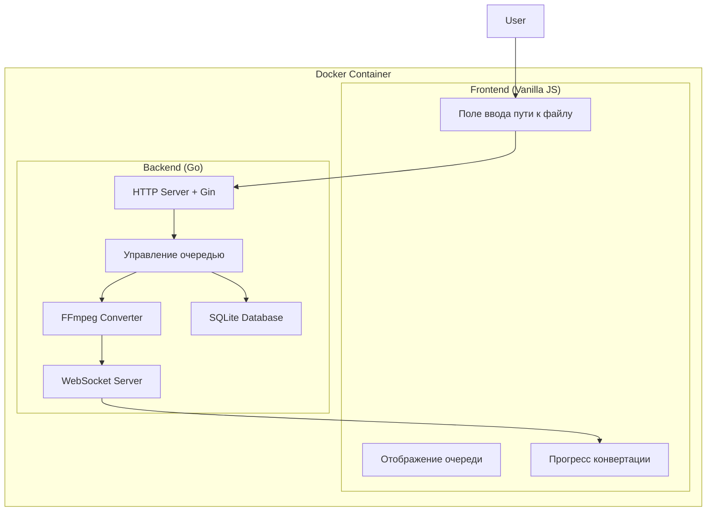

# Architecture - DTS to FLAC Converter (Go Edition)

## Обзор

Архитектура сервиса конвертации аудиодорожек DTS-HD MA в FLAC с использованием Go для оптимальной производительности.

## Почему Go?

- **Низкое потребление памяти**: 5-15MB vs 50-100MB у Node.js
- **Статическая компиляция**: Один бинарный файл без зависимостей
- **Высокая производительность**: Нативный код без garbage collection пауз
- **Простота развертывания**: Скопировать и запустить

## Архитектура

## Компоненты системы

### Backend (Go)

#### 1. HTTP сервер с Gin
Основной компонент, обрабатывающий API запросы и WebSocket соединения.

#### 2. Модель задачи (SQLite)
Структура данных для хранения информации о задачах конвертации:
- ID, пути к файлам, статус, прогресс
- Временные метки и сообщения об ошибках

#### 3. Сервис конвертации
Компонент, управляющий процессом FFmpeg конвертации:
- Запуск FFmpeg с нужными параметрами
- Парсинг вывода для отслеживания прогресса
- Обработка ошибок

#### 4. WebSocket сервер
Реализация real-time обновлений прогресса конвертации:
- Управление подключениями клиентов
- Рассылка обновлений прогресса

### Frontend (Vanilla JavaScript)

#### 1. HTML структура
Простой интерфейс с полями ввода и отображением очереди

#### 2. JavaScript приложение
Клиентская логика:
- Управление WebSocket соединением
- Отправка API запросов
- Обновление интерфейса в реальном времени

## Docker конфигурация

### docker-compose.yml
Конфигурация контейнеров для backend и frontend сервисов

### Backend Dockerfile
Мультистейдж билд Go приложения с FFmpeg

## Преимущества архитектуры

1. **Низкое потребление памяти** - 5-15MB против 50-100MB у Node.js
2. **Высокая производительность** - нативный код без garbage collection пауз
3. **Простое развертывание** - один бинарный файл без зависимостей
4. **Стабильная работа** - оптимизирована для эффективной работы
5. **Низкое энергопотребление** - важно для серверных решений

Эта архитектура обеспечивает стабильную работу конвертера с минимальным потреблением ресурсов.