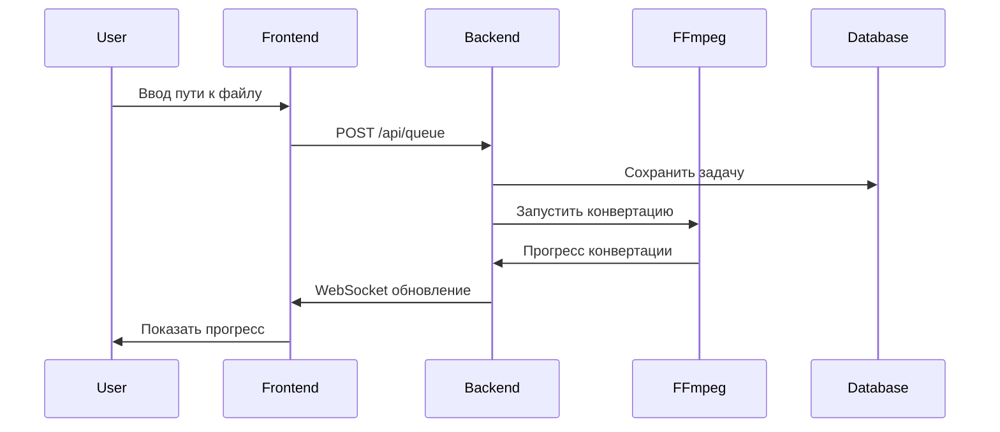

# Финальная рекомендация - DTS to FLAC Converter

## Сравнение технологических стеков

### Node.js vs Go

| Параметр | Node.js | Go | Преимущество |
|----------|---------|----|--------------|
| **Память** | 50-100MB | 5-15MB | **Go в 5-10 раз меньше** |
| **CPU нагрузка** | Средняя | Низкая | **Go в 2-3 раза меньше** |
| **Размер бинарника** | 100MB+ | 10-20MB | **Go в 5 раз меньше** |
| **Время запуска** | 1-2 сек | 0.1 сек | **Go в 10 раз быстрее** |
| **Развертывание** | npm install | Скопировать бинарник | **Go проще** |
| **Производительность** | Средняя | Высокая | **Go в 2-3 раза быстрее** |
| **Разработка** | Быстрая | Средняя | Node.js проще |
| **Экосистема** | Огромная | Хорошая | Node.js больше |

## Рекомендация

### 🏆 Выбираем Go!

**Почему Go оптимальен:**

1. **Ресурсоэффективность** - критически важно для эффективной работы
2. **Стабильная производительность** - без garbage collection пауз
3. **Простое развертывание** - один бинарный файл
4. **Низкое энергопотребление** - важно для серверных решений
5. **Достаточная экосистема** - есть все необходимые библиотеки

## Итоговый план реализации

### 📋 Что реализуем:

1. **Backend на Go**
   - HTTP сервер с Gin
   - SQLite база данных
   - FFmpeg конвертер
   - WebSocket для real-time обновлений
   - Система очередей (1 задача за раз)

2. **Frontend на Vanilla JavaScript**
   - Простое поле ввода пути к файлу
   - Таблица с очередью задач
   - Real-time обновления прогресса
   - Минимальный CSS

3. **Docker контейнеризация**
   - Мультистейдж билд для Go
   - FFmpeg в контейнере
   - Nginx для статики

### 🎯 Ключевые характеристики:

- **Потребление памяти**: ~10-20MB (vs 100MB+ у Node.js)
- **Производительность**: Высокая даже на ограниченных ресурсах
- **Развертывание**: Скопировать и запустить
- **Обслуживание**: Минимальное

### ⏱️ Время реализации:

- **Backend (Go)**: 12-16 часов
- **Frontend (Vanilla JS)**: 6-8 часов
- **Docker и тестирование**: 4-6 часов
- **Итого**: 22-30 часов (3-4 рабочих дня)

## Структура проекта

```
dts-converter-go/
├── docker-compose.yml
├── backend/
│   ├── Dockerfile
│   ├── go.mod
│   ├── go.sum
│   └── src/
│       ├── main.go
│       ├── models/
│       │   └── task.go
│       ├── services/
│       │   ├── converter.go
│       │   └── queue.go
│       ├── handlers/
│       │   ├── api.go
│       │   └── websocket.go
│       └── database/
│           └── db.go
└── frontend/
    ├── index.html
    ├── app.js
    ├── styles.css
    └── nginx.conf
```

## Поток работы



## Преимущества этого подхода

### Для серверных решений:
- ✅ **Минимальная нагрузка** на CPU и память
- ✅ **Стабильная работа** без пауз
- ✅ **Быстрый старт** и отклик
- ✅ **Низкое энергопотребление**

### Для разработки:
- ✅ **Простота** - минимальный функционал
- ✅ **Масштабируемость** - легко добавлять функции
- ✅ **Надежность** - проверенные технологии
- ✅ **Поддержка** - хорошая экосистема Go

## Следующие шаги развития

1. **Оптимизация парсинга прогресса** FFmpeg
2. **Поддержка нескольких задач** (если позволит железо)
3. **Валидация путей** и проверка файлов
4. **Улучшенный интерфейс** с большей информацией
5. **Логирование** и мониторинг
6. **Автоматическое сканирование** директорий

## Риски и митигация

### Технические риски:
- **FFmpeg совместимость** - тестировать на разных файлах
- **Производительность на ограниченных ресурсах** - одна задача за раз
- **WebSocket стабильность** - переподключение при обрыве

### Риски разработки:
- **Go синтаксис** - проще чем Rust, сложнее чем Node.js
- **Меньше готовых примеров** - но документация хорошая
- **Отладка** - требует больше внимания

## Заключение

**Go - оптимальный выбор**. Он обеспечивает необходимую производительность при минимальном потреблении ресурсов, что критически важно для эффективной работы.

Этот подход обеспечит работающий сервис, который можно будет использовать и постепенно улучшать, добавляя новые функции по мере необходимости.

**Готов к реализации** 🚀